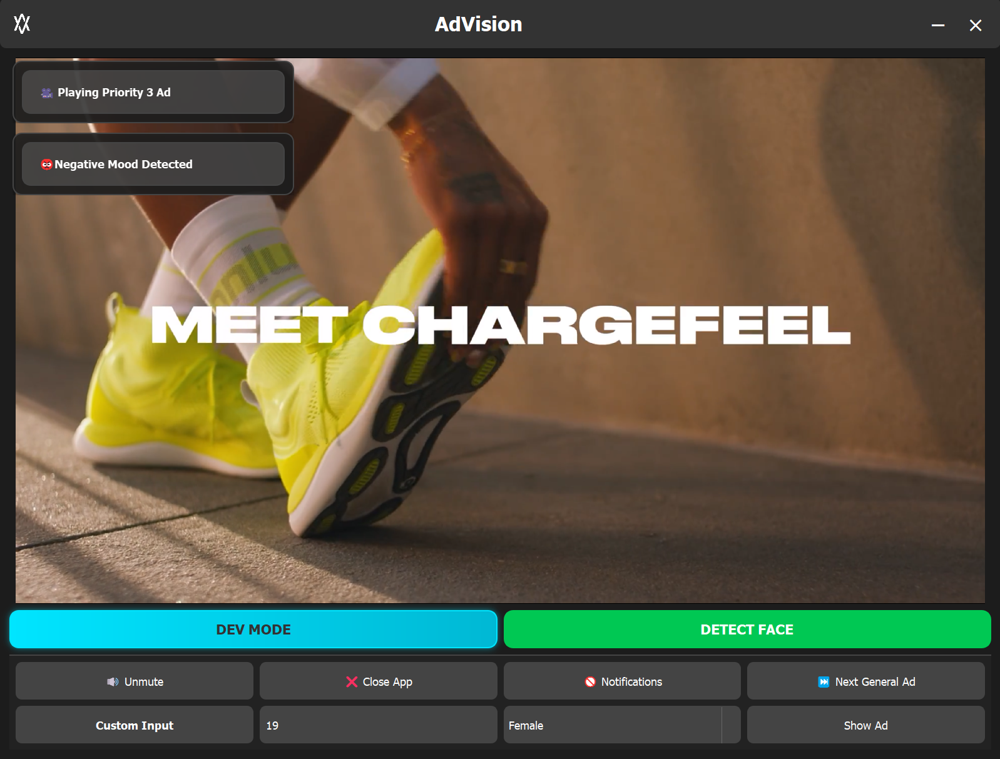
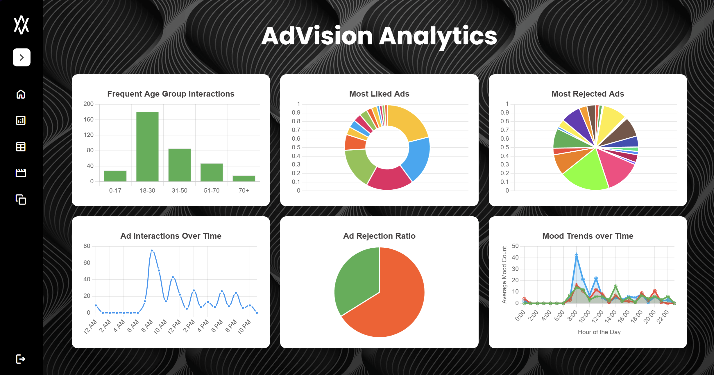
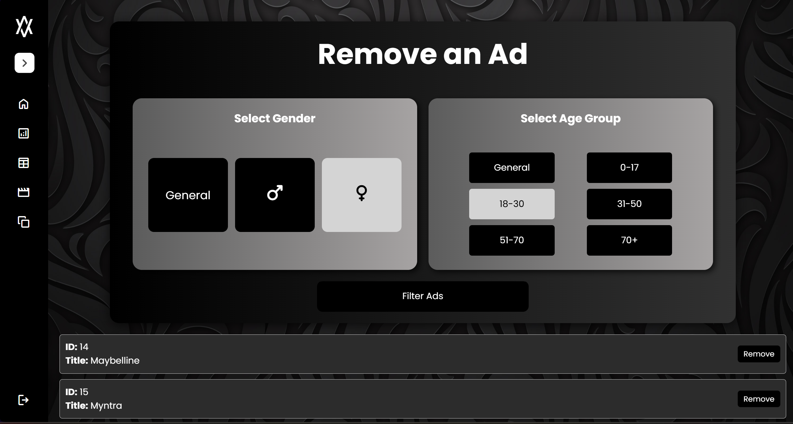

# AdVision — AI-Powered Smart Billboard System

**AdVision** is an intelligent, face-aware advertising system that personalizes and adapts ad content in real time. It mimics a smart public billboard — not with hardware, but through a sleek **PyQt5 desktop application** powered by AI.

Whether it's detecting who’s watching or tracking how they emotionally respond to an ad, **AdVision** dynamically chooses and switches ads to create a hyper-targeted and reactive ad experience.

---

## How It Works

1. **Face Detection & Demographics**
   - A webcam feed continuously monitors for human faces.
   - Once detected, the frame is passed to a deep learning model via **DeepFace**.
   - The model extracts **age** and **gender**, which are then used to pick a suitable ad from the system's database.

2. **Ad Playback**
   - Based on the viewer’s demographics, the app plays a relevant ad video through the PyQt5 interface.
   - This simulates how a smart digital billboard would behave in a public environment.

3. **Mood Tracking & Real-Time Ad Switching**
   - While the ad plays, the system monitors the viewer’s **emotional state** in real time.
   - If the viewer shows **negative emotion** (e.g., anger or sadness), the ad is immediately **switched out** for another one better suited to recover engagement.

---

## Desktop App Highlights

> The system is implemented as a full-featured **PyQt5 desktop application**, making it portable and easy to demo on any computer — no physical billboard hardware needed.

In **Developer Mode**, you can:
- Simulate age/gender manually for demo testing
- Enable or mute ad audio
- Skip to the next ad with manual controls

This mode is perfect for testing, debugging, or controlled demos.

---

## Analytics & Insight Dashboard

Every interaction with the billboard is logged — including demographic info, mood changes, ad playback stats, and time of day. This data is visualized through a web-based dashboard to help administrators optimize the system.

The dashboard includes:
- **Charts and graphs** based on mood transitions, ad performance, and viewership patterns
- **Time-of-day insights** to identify when each ad performs best
- **Demographic filters** to see which age/gender group responds best to which ad

This allows stakeholders to tweak ad strategy with **real behavioral data** — not guesswork.

---

## AdManager Website

The project also includes **AdManager**, a companion website that connects directly to the system’s **SQLite database** to provide administrative control and data visibility.

###  Website Features:
-  **View Ad Logs** — Full table of all ad interactions with timestamps, demographics, and mood responses
-  **View All Available Ads** — Table showing every ad in the system, including metadata (age group, gender, priority, file path)
-  **Add Ads** — Upload new ad entries into the database with assigned demographic tags
-  **Remove Ads** — Instantly delete any unwanted or underperforming ads

Admins can use this site to manage ads remotely, analyze what's working, and update the system without touching the codebase.

---

## Built With

- **Python** (Core logic)
- **PyQt5** (GUI for the desktop app)
- **DeepFace** (Facial age, gender, and mood analysis)
- **FastAPI** (Backend API for database access)
- **SQLite** (Lightweight, local database)
- **HTML/CSS/JS** (AdManager web dashboard)
- **Chart.js / Matplotlib** (Analytics visualizations)

---

## Use Cases

- Smart advertising billboards
- Interactive retail display systems
- AI-based digital signage for malls, stations, events
- University-level AI/ML + UI project demo

---

## Summary

AdVision brings together facial analysis, mood tracking, real-time UI, and an admin dashboard into a single system that feels like a futuristic advertising tool — all built with simple but powerful tools like Python, SQLite, and JavaScript.

It’s not just a project. It’s a **functional prototype** for the future of advertising.

---
